# 🧠 AI Policy Execution Platform (NLP Engine)

> **Transforming Static PDF Policies into Executable Workflows with AI & Human-in-the-Loop Verification.**


-black?style=for-the-badge&logo=openai)


---

## 🚀 The Problem
Organizations are drowning in PDF policies.
- **Ambiguity**: "Submit within *reasonable time*" (What does that mean?)
- **Manual Work**: Officers manually read, interpret, and assign tasks.
- **Compliance Risk**: Human error in interpreting rules leads to failed audits.

## 💡 Our Solution
An intelligent **NLP Engine** that:
1.  **Ingests PDFs**: Extracts complex rules automatically using Local LLMs (Llama 3).
2.  **Detects Ambiguity**: Flags vague terms like "timely manner" or "appropriate action".
3.  **Clarifies via UI**: Asks the human for specific values (e.g., "30 days").
4.  **Syncs to Execution**: Pushes clean, executable tasks to the backend workflow engine.

---

## 🏗️ System Architecture

```mermaid
graph TD
    User[Admin User] -->|1. Upload PDF| API[FastAPI Server]
    API -->|2. Extract Text| Parser[PDF Parser]
    Parser -->|3. AI Extraction| LLM[Ollama / Llama3]
    LLM -->|4. Structured Rules| Detector[Ambiguity Detector]
    
    Detector -- "✅ Clear Rules" --> Store[Temporary Store]
    Detector -- "❓ Ambiguous" --> Store
    
    User -->|5. Clarify Rules| API
    API -->|6. Merge & Clean| Store
    
    Store -->|7. Sync| Execution[Execution Backend]
    Execution -->|8. Create Tasks| DB[(Database)]
```



---

## ✨ Key Features

### 1. 🤖 Agents Policy Extraction
Uses **Llama 3 (8B)** to understand context, separating "Actions", "Conditions", "Roles", and "Deadlines" from unstructured text.

### 2. 🛡️ Ambiguity Guardrails
Unlike generic AI wrappers, our system **refuses to guess**.
- *Input*: "Notify immediately."
- *System*: "⚠️ Ambiguous! Define 'immediately' in hours/days."

### 3. ⚡️ Instant Backend Integration
One-click sync pushes cleaned rules to the **Policy Execution Backend**, instantly creating dashboard tasks for employees.

---

## 🛠️ API Documentation

### 1. Process Policy (`POST /api/policy/process`)
Upload a PDF to extract rules.
**Input**: `multipart/form-data`, file=policy.pdf, policy_id=...
**Output**: JSON with extracted rules and `ambiguity_flag`.

### 2. Clarify Rule (`POST /api/policy/clarify`)
Resolve a pinned ambiguity.
**Input**:
```json
{
  "policy_id": "POL_001",
  "rule_id": "R1",
  "clarified_deadline": "48 hours"
}
```
**Output**: Clean rule object (Ambiguity flags removed).

### 3. Sync to Execution (`POST /api/policy/submit`)
Finalize and push to the workflow engine.
**Input**: `{ "policy_id": "POL_001" }`
**Orchestration**: Transformers internal schema -> External Execution Schema -> `POST /ingest`

---

## ⚡️ Quick Start

### Prerequisites
- **Python 3.10+**
- **Ollama** (Running `llama3.1:8b`)

### Installation
```bash
# 1. Clone & Enter Directory
cd "AI NLP Model"

# 2. Install Dependencies
pip install -r requirements.txt

# 3. Start Server
uvicorn main:app --host 0.0.0.0 --port 8000
```

### Exposing to Internet (Tunnel)
```bash
# Run the included tunnel script
python tunnel_server.py
```

---

## 🧪 Testing

We include a robust test suite to verify the entire pipeline.

```bash
# Test Clarification Flow
python tests/verify_clarification.py

# Test Backend Sync
python tests/test_backend_sync.py
```

---

## 🏆 Why This Wins
- **Real Utility**: Solves the "Last Mile" problem of AI (Ambiguity).
- **Safe AI**: Human-in-the-loop ensures 100% compliance accuracy.
- **Local Privacy**: Runs strictly on local LLMs (Ollama) - No data leaves the premise.

---

*Built with ❤️ for the Hackathon.*
