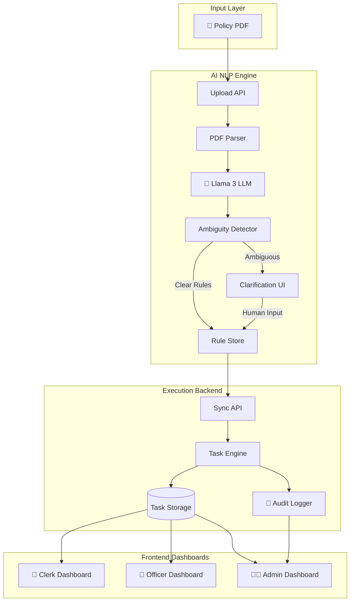

# 🏛️ AI Policy Execution Platform

> **Transforming Static PDF Policies into Live, Executable Workflows with AI-Powered Intelligence and Human-in-the-Loop Verification**

[](https://www.python.org/)
[](https://fastapi.tiangolo.com/)
[](https://ollama.ai/)
[](LICENSE)

---

## 🎯 The Problem

Organizations worldwide struggle with **policy execution**:
- 📄 **Thousands of PDF policies** gathering digital dust
- 🤔 **Ambiguous language** like "timely manner" or "reasonable time"
- 👥 **Manual interpretation** by officers leading to inconsistency
- ⚠️ **Compliance risks** from human error and misinterpretation
- 🐌 **Slow processing** of citizen requests and benefits

**The result?** Delayed services, compliance failures, and frustrated stakeholders.

---

## 💡 Our Solution

A **3-Layer AI Platform** that converts policy PDFs into executable, trackable workflows:

### 🧠 Layer 1: AI NLP Engine
Extracts structured rules from unstructured PDFs using local LLMs (Llama 3), with built-in ambiguity detection.

### ⚙️ Layer 2: Execution Backend
Monitors task states, maintains immutable audit logs, and exposes real-time APIs for dashboards.

### 🎨 Layer 3: Frontend Dashboard *(External)*
Role-based interfaces for Clerks, Officers, and Admins to manage policy execution.

---

## 🏗️ System Architecture



---

## 📁 Repository Structure

```
ai-policy-execution-platform/
├── AI NLP Model/           # 🧠 Policy extraction & ambiguity detection
│   ├── src/                # Core NLP modules
│   ├── main.py             # FastAPI server
│   ├── requirements.txt    # Python dependencies
│   └── README.md           # Detailed NLP documentation
│
├── simulation/             # ⚙️ Execution monitoring backend
│   ├── main.py             # FastAPI task & audit API
│   ├── executionFlow.js    # State transition logic
│   ├── auditLogger.js      # Immutable logging
│   └── README.md           # Backend documentation
│
├── contracts/              # 📋 JSON Schema definitions
│   ├── policy_schema.json  # Policy rule structure
│   ├── task_schema.json    # Execution task format
│   └── audit_schema.json   # Audit log format
│
└── demo/                   # 🎤 Hackathon presentation
    └── demo_script.md      # 3-minute demo script
```

---

## ✨ Key Features

### 🛡️ 1. Zero-Hallucination Guarantee
Unlike generic AI tools, our system **refuses to guess**:
- ❌ **Generic AI**: "Process within reasonable time" → Guesses "7 days"
- ✅ **Our System**: Flags as ambiguous → Requests human clarification

### 🔒 2. Privacy-First Architecture
- All AI processing uses **local Ollama models** (Llama 3)
- No data sent to external APIs
- Fully on-premise deployment ready

### 📊 3. Immutable Audit Trail
Every action is logged with:
- Timestamp (ISO 8601)
- Actor role (Clerk/Officer/Admin)
- Action type (Created/Updated/Escalated)
- Task context

### ⚡ 4. Real-Time Execution
- RESTful APIs for instant task retrieval
- Role-based filtering (`GET /tasks?role=Clerk`)
- CORS-enabled for frontend integration

---

## 🚀 Quick Start

### Prerequisites
- **Python 3.10+**
- **Ollama** with `llama3.1:8b` model
- **Node.js 16+** (for simulation scripts)

### Installation

#### 1️⃣ Start the AI NLP Engine
```bash
cd "AI NLP Model"
pip install -r requirements.txt
uvicorn main:app --host 0.0.0.0 --port 8000
```

#### 2️⃣ Start the Execution Backend
```bash
cd simulation
pip install -r requirements.txt
uvicorn main:app --port 8001 --reload
```

#### 3️⃣ Test the Integration
```bash
# Upload a policy PDF
curl -X POST http://localhost:8000/api/policy/process \
  -F "file=@policy.pdf" \
  -F "policy_id=POL-001"

# Check extracted rules
curl http://localhost:8000/api/policy/rules/POL-001

# Sync to execution backend
curl -X POST http://localhost:8000/api/policy/submit \
  -H "Content-Type: application/json" \
  -d '{"policy_id": "POL-001"}'

# Verify tasks created
curl http://localhost:8001/tasks
```

---

## 📡 API Reference

### AI NLP Engine (`localhost:8000`)

| Endpoint | Method | Description |
|:---------|:-------|:------------|
| `/api/policy/process` | POST | Upload PDF and extract rules |
| `/api/policy/clarify` | POST | Resolve ambiguous rules |
| `/api/policy/submit` | POST | Sync to execution backend |

### Execution Backend (`localhost:8001`)

| Endpoint | Method | Description |
|:---------|:-------|:------------|
| `/tasks` | GET | Get all tasks (Admin) |
| `/tasks?role={ROLE}` | GET | Get tasks by role |
| `/audit-logs` | GET | Get execution history |
| `/health` | GET | Health check |

---

## 🧪 Testing

### Test AI Extraction
```bash
cd "AI NLP Model"
python tests/test_all.py
```

### Test Backend Sync
```bash
cd "AI NLP Model"
python tests/test_backend_sync.py
```

### Test Clarification Flow
```bash
cd "AI NLP Model"
python tests/verify_clarification.py
```

---

## 🎯 Use Cases

### 🏛️ Government & Public Sector
- Automate citizen benefit processing
- Ensure policy compliance
- Reduce processing time from weeks to hours

### 🏢 Corporate Compliance
- Convert HR policies into trackable workflows
- Audit trail for regulatory compliance
- Standardize interpretation across departments

### 🏥 Healthcare Administration
- Patient eligibility verification
- Insurance claim processing
- Treatment protocol enforcement

---

## 🏆 Why This Platform Wins

| Feature | Traditional Approach | Our Platform |
|:--------|:--------------------|:-------------|
| **Policy Interpretation** | Manual reading | AI-powered extraction |
| **Ambiguity Handling** | Officer guesswork | Mandatory clarification |
| **Audit Trail** | Paper logs | Immutable digital logs |
| **Task Assignment** | Email/Spreadsheets | Real-time dashboard |
| **Compliance Risk** | High (human error) | Low (verified rules) |
| **Processing Speed** | Days/Weeks | Minutes/Hours |

---

## 📚 Documentation

- **[AI NLP Engine Documentation](AI%20NLP%20Model/README.md)** - Detailed guide on policy extraction
- **[Execution Backend Documentation](simulation/README.md)** - API reference and architecture
- **[Demo Script](demo/demo_script.md)** - 3-minute presentation guide
- **[Schema Contracts](contracts/)** - JSON schema definitions

---

## 🤝 Contributing

This is a hackathon project. For questions or collaboration:
1. Review the component-specific READMEs
2. Check the `/contracts` folder for data schemas
3. Test using the provided test suites

---

## 📄 License

**Internal Use Only** - Built for the AI Policy Execution Platform Hackathon.

---

## 🙏 Acknowledgments

- **Ollama Team** - For local LLM infrastructure
- **FastAPI** - For blazing-fast API development
- **Hackathon Organizers** - For the opportunity to solve real problems

---

<div align="center">

**Built with ❤️ to solve the "Last Mile" problem of AI compliance**

[🚀 Get Started](#-quick-start) • [📖 Documentation](#-documentation) • [🧪 Run Tests](#-testing)

</div>
