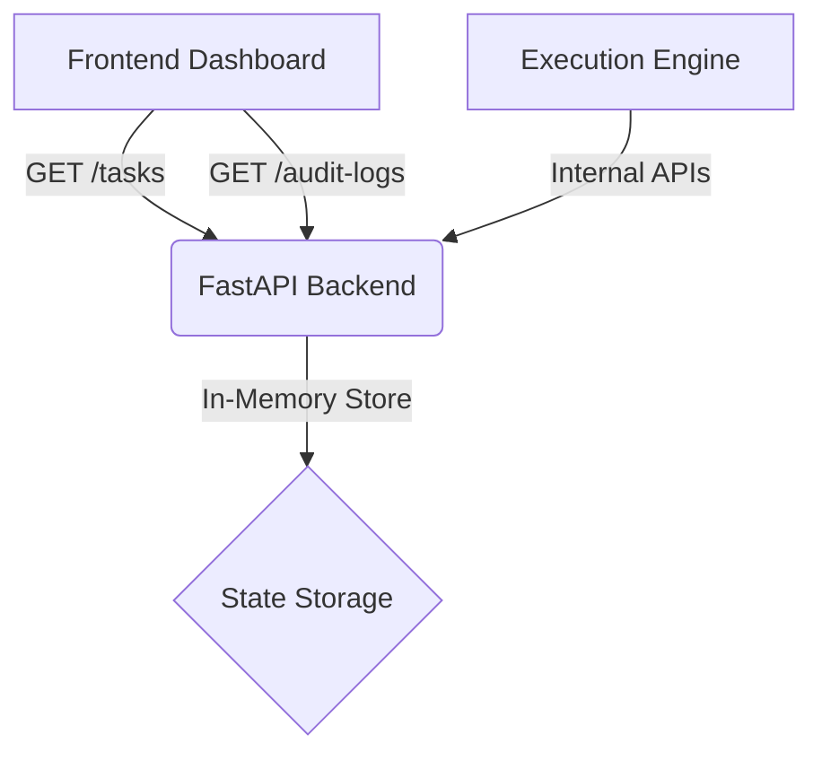

# 🛠️ Simulation Engine & Execution Monitoring Backend

Welcome to the **Execution Monitoring Layer**. This module is responsible for real-time task state tracking, immutable audit logging, and exposing read-only APIs for the frontend dashboards. It serves as the "Execution Truth" for the entire Policy Platform.

---

## 🚀 Overview

The Simulation Engine provides a "Green Baseline" environment to monitor policy execution without external dependencies. It adheres to strict state transition rules and maintains an append-only audit trail for transparency.

### Core Responsibilities:
- **Task State Tracking**: Monitors tasks through their lifecycle (`CREATED` → `ASSIGNED` → `IN_PROGRESS` → `COMPLETED`/`ESCALATED`).
- **Audit Log Generation**: Automatically records every action with timestamps and actor roles.
- **Frontend Dashboard APIs**: Exposes high-performance endpoints for Clerk, Officer, and Admin dashboards.

---

## 🏗️ Architecture

The backend is built with **FastAPI** (Python), prioritizing speed and developer-friendly documentation.



---

## 🛠️ Setup & Installation

### Prerequisites
- Python 3.9+
- pip (Python package manager)

### Installation Steps

1. **Navigate to the simulation directory:**
   ```bash
   cd simulation
   ```

2. **Install dependencies:**
   ```bash
   pip install -r requirements.txt
   ```

3. **Start the server:**
   ```bash
   uvicorn main:app --reload --port 8000
   ```
   *The server will be available at `http://localhost:8000`*

---

## 📡 API Documentation

### 1. Dashboard APIs (Read-Only)

#### `GET /tasks`
Retrieves tasks based on access level.
- **Admin**: Returns all tasks.
- **Role-based**: Use `?role={ROLE}` to filter (e.g., `?role=Clerk`).

#### `GET /audit-logs`
Returns the full history of system events. Logs are **immutable** and **append-only**.

### 2. Internal APIs (Simulation)

Used to populate the system and simulate real-world execution.

| Endpoint | Method | Description |
| :--- | :--- | :--- |
| `/internal/tasks` | `POST` | Create a new execution task. |
| `/internal/tasks/{id}` | `PATCH` | Update task status & trigger audit logs. |

---

## 📋 Data Schema

### Task Object
```json
{
  "task_id": "T-101",
  "policy_id": "POL-2024",
  "task_name": "Document Verification",
  "assigned_role": "Clerk",
  "status": "IN_PROGRESS",
  "deadline": "5 Business Days"
}
```

### Audit Log Object
```json
{
  "log_id": "L-A1B2",
  "task_id": "T-101",
  "action": "STATUS_CHANGED_TO_IN_PROGRESS",
  "performed_by_role": "Clerk",
  "timestamp": "2026-01-14T10:32:00Z"
}
```

---

## ⚖️ License
Internal Use Only - 3D Policy Platform Hackathon Project.
